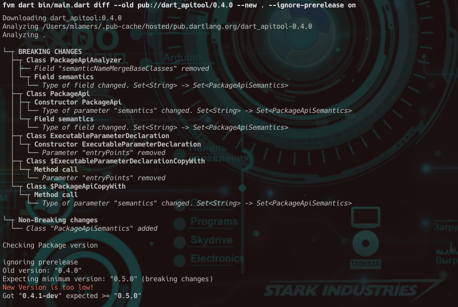

# Dart API Tool

A tool to analyze the public API of a package and create a model of it.
It also allows to use that model to compare the public API with a newer version and check if the version follows [semver](https://semver.org) correctly.

[](https://github.com/devmil/dart_apitool/actions/workflows/ci.yml) [](https://pub.dev/packages/dart_apitool)

## Installation

To install activate the tool via dart pub:
```bash
dart pub global activate dart_apitool
```

## Screenshot


## Usage

After activation the tool is usable via
```bash
dart-apitool
```

```plain
A set of utilities for Package APIs

Usage: dart-apitool <command> [arguments]

Global options:
-h, --help    Print this usage information.

Available commands:
  diff      Creates a diff of 2 given packages.
  extract   Extracts the API from the given package ref.

Run "dart-apitool help <command>" for more information about a command.
```

### extract

```plain
Extracts the API from the given package ref.

Usage: dart-apitool extract [arguments]
-h, --help                               Print this usage information.
    --input (mandatory)                  Input package ref. Package reference can be one of:
                                         - directory path pointing to a package on disk
                                           (e.g. /path/to/package)
                                         - an extract file generated by dart-apitool
                                           (e.g. packageApi.json)
                                         - any package from pub
                                           (e.g. pub://package_name/version)
    --output                             Output file for the extracted Package API.
                                         If not specified the extracted API will be printed to the console.
    --no-merge-base-classes              Disables base class merging.
    --no-analyze-platform-constraints    Disables analysis of platform constraints.
```

### diff

```plain
Creates a diff of 2 given packages.

Usage: dart-apitool diff [arguments]
-h, --help                               Print this usage information.
    --old (mandatory)                    Old package reference. Package reference can be one of:
                                         - directory path pointing to a package on disk
                                           (e.g. /path/to/package)
                                         - an extract file generated by dart-apitool
                                           (e.g. packageApi.json)
                                         - any package from pub
                                           (e.g. pub://package_name/version)
    --new (mandatory)                    New package reference. Package reference can be one of:
                                         - directory path pointing to a package on disk
                                           (e.g. /path/to/package)
                                         - an extract file generated by dart-apitool
                                           (e.g. packageApi.json)
                                         - any package from pub
                                           (e.g. pub://package_name/version)
    --[no-]check-versions                Determines if the version of the new package should be checked.
                                         Takes the changes of the diff and checks if the new version follows the semver rules.
                                         Influences tool return value.
                                         (defaults to on)
    --[no-]check-sdk-version             Determines if the SDK version should be checked.
                                         (defaults to on)
    --[no-]ignore-prerelease             Determines if the pre-release aspect of the version shall be ignored when checking versions.
                                         This only makes sense in combination with --check-versions.
                                         You may want to do this if you want to make sure
                                         (in your CI) that the version - once ready - matches semver.
    --no-merge-base-classes              Disables base class merging.
    --no-analyze-platform-constraints    Disables analysis of platform constraints.
```

## Integration

How to best integrate `dart-apitool` in your CI and release process highly depends on your setup.

In general, you need to have a reference of what has been released before in order to do a diff to the new sources.

To do that you have several options:
1. store the last released version next to your source code
2. store the extracted public API next to your source code
3. use whatever knowledge your release process has to get a copy of the previously released version

Depending on what you have as a reference you can call `dart-apitool` using the appropriate package ref for the `old` parameter:
1. pub://[package_name]/[package-version] if you know the last released version and your package is hosted at pub
2. [path-to-extract.json] to load the stored public API model
3. [path-to-copy] to get the public API model from the obtained reference copy

### CI

For an example how to integrate `dart-apitool` in your CI (to make sure that the current pre-release version is targeting the right version number) you can refer to the [workflow](.github/workflows/ci.yml#L77) used by this repository.
`dart-apitool` uses approach 1 (store the last released version next to the source code)
For your convenience there is a reusable workflow that you can integrate in your workflow.
```yml
  semver:
    uses: devmil/dart_apitool/.github/workflows/check_version.yml@workflow/v1
    with:
      runs-on: [your build node] # defaults to ubuntu-latest
      old: [package ref to old] # required, e.g. "pub://dart_apitool/<old version>"
      new: [package ref to new] # e.g. "."
      ignore-prerelease: ['on' if you want to check against the future version (without pre-release), defaults to 'off'] # e.g. 'on'
      flutter-channel: [flutter channel to use, defaults to 'stable'] # e.g. 'stable'
      flutter-version: [flutter version to use, defaults to 'any'] # e.g. 'any'
```

### Release

Your release process has to make sure that the reference is stored somehow. The easiest way to do that is to store a file containing the last released version next to the source code (`dart-apitool` does that).
The release process can also use `dart-apitool` to make sure that the new version matches the changes it contains.

## Contributions
Any kind of contribution is very welcome. 
Either you have found a false positive or you miss something in the public API model that needs to be analyzed or if you want to contribute directly.
Feel free to use the [issues](https://github.com/devmil/dart_apitool/issues) to create requests.

## Limitations
It doesn't cover all potential API changes that might lead to breaking changes.

### It does not look into implementations
Imagine a class:
```dart
class MyClass<T> {
  String doSomething(T arg) {
    final castedArg = arg as SomeBaseClass;
    return castedArg.baseClassMethod();
  }
}
```
that got changed to
```dart
class MyClass<T> {
  String doSomething(T arg) {
    final castedArg = arg as SomeOtherBaseClass;
    return castedArg.otherBaseClassMethod();
  }
}
```
Changes in the implementation are not detected.

### Verdict

You have to keep your eyes 👀 open and always remember the public API! 

`dart-apitool` can help you find problematic changes on Dart API level, but it can't detect everything. 😉
